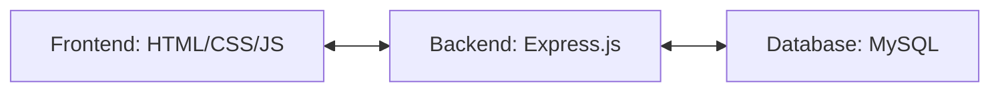

# 🛠️ Equipment Maintenance Management System (EMMS)

[](https://www.mysql.com/)
[](https://nodejs.org/)
[](https://expressjs.com/)
[](https://developer.mozilla.org/en-US/docs/Web/JavaScript)
[](https://developer.mozilla.org/en-US/docs/Web/HTML)
[](https://developer.mozilla.org/en-US/docs/Web/CSS)

## 📝 Project Description

The **Equipment Maintenance Management System (EMMS)** is a comprehensive web-based application designed to streamline the management and maintenance of industrial, laboratory, or office equipment. This system provides a centralized platform to track equipment inventory, schedule routine maintenance, record service history, and monitor costs and downtime. 

Built as a **DBMS Mini Project**, it demonstrates the integration of a relational database with a modern full-stack architecture to solve real-world operational challenges.

---

## ✨ Features

- 🔐 **User Authentication & Role Management**: Secure login for Admins, Technicians, and Supervisors with role-based access control.
- 📦 **Equipment Inventory**: Detailed tracking of equipment specifications, location, status, and purchase details.
- 📅 **Maintenance Scheduling**: Automated and manual scheduling of preventive maintenance tasks.
- 📜 **Service History**: Comprehensive logs of all past maintenance activities, including downtime and costs.
- ⏰ **Service Reminders**: System-generated alerts for upcoming and overdue maintenance tasks.
- 💰 **Cost Analysis**: Track expenditures associated with parts, labor, and external services.
- 📉 **Downtime Monitoring**: Record and analyze equipment unavailability to improve operational efficiency.
- 📊 **Dashboard Analytics**: Real-time overview of equipment status, recent activities, and pending tasks.

---

## 🎯 Objectives

1.  **Centralization**: To provide a single source of truth for all equipment-related data.
2.  **Efficiency**: To reduce manual paperwork and automate maintenance scheduling.
3.  **Reliability**: To minimize equipment failure through timely preventive maintenance.
4.  **Cost Optimization**: To monitor and control maintenance expenses.
5.  **Compliance**: To maintain accurate records for audit and safety standards.

---

## 🚀 Technologies Used

| Layer | Technology |
| :--- | :--- |
| **Frontend** | HTML5, CSS3, JavaScript (Vanilla JS) |
| **Backend** | Node.js, Express.js |
| **Database** | MySQL |
| **API Testing** | Postman / Thunder Client |
| **Version Control** | GitHub |
| **IDEs / Tools** | VS Code, MySQL Workbench |

---

## 🏗️ System Architecture

The project follows a **Client-Server Architecture**:

1.  **Presentation Layer (Frontend)**: User-friendly interface built with HTML/CSS and interactive JS components.
2.  **Application Layer (Backend)**: Express.js server handling RESTful API requests, business logic, and database operations.
3.  **Data Layer (Database)**: MySQL relational database storing all project entities and relationships.



---

## 🗃️ Database Details

The system uses a relational schema with the following primary tables:

| Table Name | Description |
| :--- | :--- |
| `users` | Stores user credentials, contact info, and roles (Admin/Technician). |
| `equipment` | Contains details of all equipment being managed. |
| `maintenance_schedules` | Tracks planned maintenance dates and priorities. |
| `maintenance_history` | Records completed maintenance tasks, costs, and downtime. |
| `service_reminders` | Stores notifications for upcoming services. |
| `equipment_parts` | Tracks spare parts associated with specific equipment. |
| `maintenance_costs` | Detailed breakdown of expenses per maintenance activity. |

---

## ⚙️ Installation Steps

### 1. Prerequisites
- Node.js (v14 or higher)
- MySQL Server
- Git

### 2. Clone the Repository
```bash
git clone https://github.com/deeksha-sn/Equipment-Maintenance-Management-System.git
cd Equipment-Maintenance-Management-System
```

### 3. Database Setup
1. Open **MySQL Workbench**.
2. Create a new database named `emms_db`.
3. Import the SQL files located in `backend/database/` in the following order:
   - `schema.sql`
   - `stored_procedure.sql`
   - `trigger.sql`
   - `sample_data.sql` (Optional)

### 4. Backend Configuration
1. Navigate to the `backend` folder:
   ```bash
   cd backend
   ```
2. Install dependencies:
   ```bash
   npm install
   ```
3. Create a `.env` file in the `backend` directory and add your MySQL credentials:
   ```env
   PORT=5000
   DB_HOST=localhost
   DB_USER=your_username
   DB_PASSWORD=your_password
   DB_NAME=emms_db
   ```

---

## 🏃 How to Run the Project

### Start the Backend
```bash
cd backend
npm run dev
```
The server will start on `http://localhost:5000`.

### Launch the Frontend
Simply open `frontend/index.html` in your preferred web browser.

---

## 📂 Folder Structure

```text
EMMS/
├── backend/
│   ├── src/
│   │   ├── controllers/    # Business logic
│   │   ├── models/         # Database models
│   │   ├── routes/         # API endpoints
│   │   └── middleware/     # Auth and validation
│   ├── database/           # SQL schema and scripts
│   ├── .env                # Environment variables
│   ├── server.js           # Main entry point
│   └── package.json
├── frontend/
│   ├── css/                # Stylesheets
│   ├── js/                 # Client-side scripts
│   ├── src/                # Frontend components
│   └── index.html          # Main landing page
└── README.md
```

---

## 🧩 Sample Modules

- **Inventory Module**: Search, filter, and add new equipment.
- **Scheduler Module**: Calendar view for maintenance tasks.
- **Reports Module**: Generate costs and downtime reports.
- **Admin Panel**: Manage users and system settings.

---

## 🔮 Future Enhancements

- 📈 **Predictive Maintenance**: Using AI/ML to predict equipment failure based on history.
- 📱 **Mobile Application**: Flutter/React Native app for technicians on the go.
- 🔗 **IoT Integration**: Real-time sensor data for automated downtime logging.
- 📧 **Email/SMS Notifications**: Automated alerts for maintenance schedules.

---


## 👥 Team Members

- **Deeksha SN** - 1GA24CI038
- **Ananya E Gowda** - 1GA24CI016
- **Anagha Pandit** - 1GA24CI014
- **Jhanvi Singh A** - 1GA25CI404

---

## 🎓 Conclusion

This project effectively demonstrates the use of relational databases in managing industrial operations. By providing a streamlined workflow for equipment maintenance, EMMS helps organizations increase the lifespan of their assets and reduce unexpected operational halts.

---

## 📄 License

This project is licensed under the **ISC License** - see the [package.json](backend/package.json) file for details.

---
Developed with ❤️ for DBMS Mini Project.
